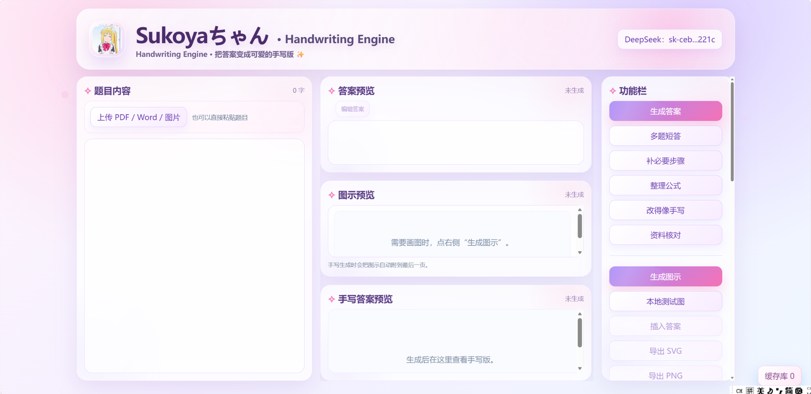
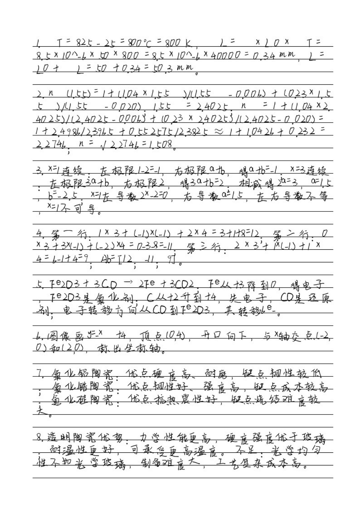

# 手写版转化器

## 网页预览效果



## 手写生成效果



> **Sukoyaちゃん · Handwriting Engine**  
> 一个本地运行的手写版转化工具：上传/粘贴题目 → 生成答案 → 编辑答案 → 转成手写版 → 导出 PDF。

## 项目亮点

- 支持 PDF / Word / 图片上传，也支持直接粘贴题目
- DeepSeek 生成答案，支持整理公式、补步骤、改得像手写
- 生成后的答案可以人工编辑，点击“结束更改”后再生成手写版
- 支持 `sukoya` / `seuomi` 两套书写体档案
- 支持混乱度调节：工整 / 自然 / 偏乱
- 支持晕染次数调节：干净 / 轻微 / 中等 / 明显
- 支持图示生成，可选择是否插入手写答案下方
- 支持手写预览图与 PDF 导出
- DeepSeek Key 运行时填写，不写进仓库

## 演示用测试文本

复制 `examples/demo_input_all_features.txt` 的内容到网页输入框，可以覆盖测试：

- 分数、根号、负号
- 矩阵、向量、乘号
- 分段函数、大括号
- 化学方程式
- 表格整理
- 普通中文简答
- 图示生成
- 答案编辑
- 混乱度 / 晕染次数
- sukoya / seuomi 切换
- PDF 导出

## 快速启动

Windows：

```bat
START.bat
```

启动后打开浏览器，填写 DeepSeek API Key 即可使用。

## 字体说明

GitHub 包不内置字体文件。  
本地使用时，把自己的字体放入：

```text
ttf_files/sukoya.ttf
ttf_files/seuomi.ttf
```

如果没有字体文件，程序会临时使用本机系统中文字体兜底。

## 目录结构

```text
backend/                         后端 FastAPI
frontend/                        前端 Vue
ttf_files/                       本地字体目录
my_handwriting_samples_pdf/       手写样本目录
examples/demo_input_all_features.txt  全功能测试文本
docs/web-preview.png             网页预览图
docs/handwriting-preview.jpg     手写效果图
START.bat                        Windows 一键启动
```

## GitHub 提交前注意

不要提交真实 API Key。  
本项目已忽略：

```text
backend/.env
.env
api_key.txt
deepseek_key.txt
node_modules/
frontend/dist/
```
